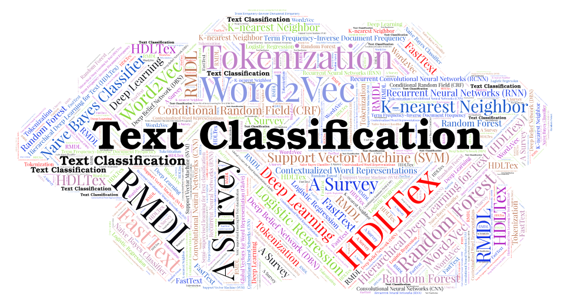

# Portfolio-S1-2021

Portfolio template repository for COMP6200: Data Science at Macquarie University

| Student Name | Student ID |
| ---: | ---: |
| Piyakorn Munegan (Mona) | 46318461 |

  

__Portfolio projects:__
  1. Analysis of cycling data - Explore relationship between Strava, GoldenCheetah and weather, and plot time series information.
  2. Predicting the energy usage of a house based on Internet of Things (IoT) measurements of temperature and humidity and weather observation.
  3. Building predictive models to classify the books into one of the five target genres.

* Methods Used
    * Data Visualization
    * Machine Learning
    * Predictive Modeling
    * etc
 
* Technologies
    * Python
    
  
   
:bicyclist: <blockquote>:bicyclist:Portfolio 1:</blockquote>

* Introdution :bicyclist:

The first dataset is an export of my ride data from [Strava](https://strava.com/), an online social network site for cycling and other sports. This data is a log of every ride since the start of 2018 and contains summary data like the distance and average speed. 
The second dataset comes from an application called [GoldenCheetah](https://www.goldencheetah.org/) which provides some analytics services over ride data. This has some of the same fields but adds a lot of analysis of the power, speed and heart rate data in each ride. This data overlaps with the Strava data but doesn't include all of the same rides.

This portfolio aims to analyse the relationship between Strava, GoldenCheetah and also [Weather](http://www.bom.gov.au/) data from a relevant source. Additional, analysing Time-series data to explore the trend and pattern of the relevant factors over the period.

  

<blockquote>Portfolio 2:</blockquote>

* Introdution

The goal of the second portfolio is to reproduce some work on[Data driven prediction models of energy use of appliances in a low-energy house.](http://dx.doi.org/10.1016/j.enbuild.2017.01.083) Luis M. Candanedo, Véronique Feldheim, Dominique Deramaix. Energy and Buildings, Volume 140, 1 April 2017, Pages 81-97, ISSN 0378-7788. 

This research aims to predict the energy usage of a house based on Internet of Things (IoT) measurements of temperature and humidity and weather observations. First, we need to explore the data distribution and analysis the relationship among several observations. Second, The linear regression model was performed and the model performances have been reported. Lastly, the Recursive Feature Elimination with Cross-Validation was used to find the optimal number of predictors. 

  
<blockquote>Portfolio 3:</blockquote>

* Introdution

The goal of this portfolio is to use a set of book summaries from the [CMU Book Summaries Corpus](http://www.cs.cmu.edu/~dbamman/booksummaries.html) and build predictive models to classify the books into one of the five target genres.

We need to extract suitable features from the texts and select suitable text classification models to classify them and compare the prediction results.

There are 6 predictive models using in this experiment:
* Support Vector Classification (SVC)
* Logistic Regression
* Multinomial Naive Bayes
* Random Forest
* Decision Tree

